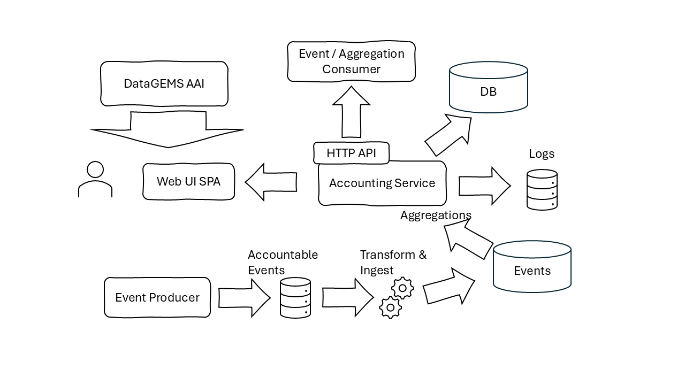

# Service Architecture

The Accounting service provides an aggregation functionality through which various services can centrally log accounting information as it is gradually accumulated by their usage from the respective authorized clients. Different accumulation policies and granularity of information is supported depending on the respective services. The information consists of globally defined key point indicators and the aggregation and reports generated based on these becomes available for further usage, as appropriate.

The overall architecture and major data flows are presented in the following diagram:

DataGEMS components that generate accountable events, utilize one of the supported [Accounting Formats](accounting-formats.md) to trace the desired events. The events are loges using the same log sink that is used for integrating with the troubleshooting logs, as described for the [Logging Service](https://datagems-eosc.github.io/dg-logging).

A dedicated processing module in the log aggregation pipeline identifies the accountable event entry and processes the event based on the transformation logic configured. This will inject the accounted event in a dedicated event aggregation store that will facilitate further processing and aggregations.

The accounting service offers its functionality through HTTP API endpoints. These endpoints expose its operational logic, management facilities but also event aggregation functionality. In addition to the event store, the accounting service maintains a relational database for operational data as internal [Datastore](datastore.md). Operation, troubleshooting logs as well as accounting entries are generated by the service it self and made available for aggregation by the DataGEMS Logging service.

Depending on the calling user authorization, different actions and data become available as dicteded by the [Security](security.md) configuration and assigned access grants.

A Web user interface application is made available as an SPA application, dedicated to allowing authorized users to browse their own accounting data (events thry produced), or overall accounting entries per accaounted components. In addition to end users consuming the data through the web user interface, integrating components can make use of the available HTTP API to harvest information on specific accountable events, or execute aggregation queries.